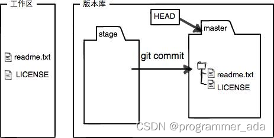

<font face="楷体" size=3>

# Git使用

在开始 Git 的基础命令学习之前，我们先来认识一下版本库——Repository，接下来我们所有提到的 Git 基础命令，都是基于版本库的。

那么什么是版本库呢？版本库又名仓库，英文名 repository，你可以简单理解成一个目录，这个目录里面的所有文件都可以被Git管理起来，每个文件的修改、删除，Git都能跟踪，以便任何时刻都可以追踪历史，或者在将来某个时刻可以“还原”。

接下来，我们首先看看 Git 版本库创建的相关命令。

## 在已存在目录中初始化仓库 —— git init

在已存在目录中创建一个版本库的过程非常简单：
首先，选择一个合适的地方，创建一个空目录：

### 创建目录

```
$ mkdir learning-git
$ cd learning-git
$ pwd
/Users/xxm/learning-git
```

pwd命令用于显示当前目录。

第二步，通过git init命令把这个目录变成 Git 可以管理的仓库：

### 初始化仓库

```
$ git init
Initialized empty Git repository in /Users/xxm/learning-git/.git/
```

瞬间 Git 就把仓库建好了，而且告诉你是一个空的仓库（empty Git repository），同时在当前目录下多了一个.git的目录，这个目录是 Git 来跟踪管理版本库的，如果你没有看到 .git 目录，那是因为这个目录默认是隐藏的，用ls -ah命令就可以看到了。

## 克隆现有的仓库 —— git clone

如果你想获得一份已经存在了的 Git 仓库的拷贝，比如说，你想为某个开源项目贡献自己的一份力，这时就要用到 git clone 命令，Git 克隆的是该 Git 仓库服务器上的几乎所有数据，而不是仅仅复制完成你的工作所需要文件。

### git clone

当你执行 git clone 命令的时候，默认配置下远程 Git 仓库中的每一个文件的每一个版本都将被拉取下来。

克隆仓库的命令是 git clone <url> 。 比如，要克隆 Git 的链接库 libgit2，可以用下面的命令：

```
$ git clone https://gitcode.net/codechina/help-docs
```

这会在当前目录下创建一个名为 help-docs 的目录，并在这个目录下初始化一个 .git 文件夹， 从远程仓库拉取下所有数据放入 .git 文件夹，然后从中读取最新版本的文件的拷贝。 如果你进入到这个新建的 help-docs 文件夹，你会发现所有的项目文件已经在里面了，准备就绪等待后续的开发和使用。

### 自定义本地仓库名称

当然如果你想在克隆远程仓库的时候，自定义本地仓库的名字也是可以的，你可以通过额外的参数指定新的目录名：

```
$ git clone https://gitcode.net/codechina/help-docs mydocs
```

这会执行与上一条命令相同的操作，但目标目录名变为了 mydocs。

Git 支持多种数据传输协议。 上面的例子使用的是 https:// 协议，不过你也可以使用 git:// 协议或者使用 SSH 传输协议，比如 user@server:path/to/repo.git 。

## 编辑并添加文件

接下来，我们来尝试在已经准备好的 Git 仓库中编辑一个readme.txt文件，内容如下：

```
Git is a version control system.
Git is free software.
```

接下来，我们可以通过2个命令将刚创建好的readme.txt添加到Git仓库：

第一步，用命令git add告诉 Git，把文件添加到仓库：

```
$ git add readme.txt
```

执行上面的命令，没有任何显示，说明添加成功。

## 提交变动到仓库

第二步，用命令git commit告诉 Git，把文件提交到仓库：

```
$ git commit -m "wrote a readme file"
[master (root-commit) 50ed06b] wrote a readme file
 1 file changed, 2 insertions(+)
 create mode 100644 readme.txt
```

```
这里简单解释一下git commit命令，-m后面输入的是本次提交的说明，可以输入任意内容，当然最好是有意义的，这样你就能从历史记录里方便地找到改动记录。
```

git commit命令执行成功后会告诉你：

- 1 file changed：1个文件被改动（我们新添加的readme.txt文件）
- 2 insertions：插入了两行内容（readme.txt有两行内容）

为什么 Git 添加文件需要add，commit一共两步呢？因为commit可以一次提交很多文件，所以你可以多次add不同的文件，比如：

```
$ git add file1.txt
$ git add file2.txt file3.txt
$ git commit -m "add 3 files."
```

## 查看Git仓库当前状态变化

我们已经成功地添加并提交了一个readme.txt文件，接下来让我们继续修改readme.txt文件，改成如下内容：

```
Git is a distributed version control system.
Git is free software.
```

### 查看 git status 结果

现在，运行git status命令看看结果：

```
$ git status
On branch master
Changes not staged for commit:
  (use "git add <file>..." to update what will be committed)
  (use "git checkout -- <file>..." to discard changes in working directory)

	modified:   readme.txt

no changes added to commit (use "git add" and/or "git commit -a")
```

git status命令可以让我们时刻掌握仓库当前的状态，上面的命令输出告诉我们，readme.txt被修改过了，但还没有准备提交的修改。

## 比较变动

虽然 Git 告诉我们readme.txt被修改了，但并没有告诉我们具体修改的内容是什么，假如刚好是上周修改的，等到周一来班时，已经记不清上次怎么修改的readme.txt，这个时候我们就需要用git diff这个命令查看相较于上一次暂存都修改了些什么内容了：

## 运行 git diff 命令

```
$ git diff readme.txt 
diff --git a/readme.txt b/readme.txt
index 46d49bf..9247db6 100644
--- a/readme.txt
+++ b/readme.txt
@@ -1,2 +1,2 @@
-Git is a version control system.
+Git is a distributed version control system.
 Git is free software.
 (END)
```

git diff顾名思义就是查看 difference，显示的格式正是 Unix 通用的 diff 格式，可以从上面的输出看到，我们在第一行添加了一个distributed单词。

## 综合操作

知道了对readme.txt作了什么修改后，再把它提交到仓库就放心多了，提交修改和提交新文件是一样的两步，第一步是git add：

### git add

```
$ git add readme.txt
```

同样没有任何输出。在执行第二步git commit之前，我们再运行git status看看当前仓库的状态：

### git status

```
$ git status
On branch master
Changes to be committed:
  (use "git reset HEAD <file>..." to unstage)

	modified:   readme.txt
```

git status告诉我们，将要被提交的修改包括readme.txt，下一步，就可以放心地提交了：

### ** git commit**

```
$ git commit -m "add distributed"
[master e55063a] add distributed
 1 file changed, 1 insertion(+), 1 deletion(-)
```

### 提交后，我们再用git status命令看看仓库的当前状态：

```
$ git status
On branch master
nothing to commit, working tree clean
```

Git告诉我们当前没有需要提交的修改，而且，工作目录是干净（working tree clean）的。

## 查看日志

如果嫌输出信息太多，看得眼花缭乱的，可以试试加上--pretty=oneline参数

### ** git log --pretty=oneline**

```
$ git log --pretty=oneline
e55063ad7f97dd979e4f94e12d2bc44a25a0fd55 (HEAD -> master) add distributed
50ed06bd62fd34afbe501e6f2a4af73ccbe187f0 wrote a readme file
(END)
```

### git log

在 Git 中，我们可以通过git log命令查看全部的commit记录：

```
$ git log
commit e55063ad7f97dd979e4f94e12d2bc44a25a0fd55 (HEAD -> master)
Author: Miykael_xxm <xiongjiamu@gmail.com>
Date:   Fri Nov 27 16:08:04 2020 +0800

    add distributed

commit 50ed06bd62fd34afbe501e6f2a4af73ccbe187f0
Author: Miykael_xxm <xiongjiamu@gmail.com>
Date:   Fri Nov 27 16:06:11 2020 +0800

    wrote a readme file
(END)
```

git log命令显示从最近到最远的提交日志，我们可以看到2次提交，最近的一次是add distributed，最早的一次是wrote a readme file。

## Git 回退

这个时候，假设我们需要将 readme.txt 回退到上一个版本，也就是 wrote a readme file 的这个版本，我们需要怎么操作呢？

首先，Git 必须知道当前版本是哪个版本，在 Git 中，用HEAD表示当前版本，也就是最新的提交e55063a，上一个版本就是HEAD^，上上一个版本就是HEAD^^，当然往上100个版本写100个^比较容易数不过来，所以写成HEAD~100。

现在，我们要把当前版本add distributed回退到上一个版本wrote a readme file，就可以使用git reset命令：

### ** git reset**

```
$ git reset --hard HEAD^
HEAD is now at 50ed06b wrote a readme file
```

现在让我们看看readme.txt的内容是不是版本wrote a readme file：

```
$ cat readme.txt
Git is a version control system.
Git is free software.
```

果然还原到最初wrote a readme file这个版本了。

Git 的版本回退速度非常快，因为 Git 在内部有个指向当前版本的HEAD指针，当你回退版本的时候，Git 仅仅是把HEAD从指向add distributed：

### ** HEAD 指针移动记录**

```
┌────┐
│HEAD│
└────┘
   │
   └──> ○ add distributed
        │
        ○ wrote a readme file
```

改为指向wrote a readme file：

```
┌────┐
│HEAD│
└────┘
   │
   │    ○ add distributed
   │    │
   └──> ○ wrote a readme file
```

然后顺便把工作区的文件更新了。所以你让HEAD指向哪个版本号，你就把当前版本定位在哪。

## Git重置

现在，你回退到了某个版本，关掉了电脑，第二天早上就后悔了，想恢复到新版本怎么办？找不到新版本的commit id怎么办？

好在 Git 提供了一个命令git reflog用来记录你的每一次命令，当你用git reset --hard HEAD^回退到wrote a readme file版本时，再想恢复到add distributed，就可以通过git reflog命令找到add distributed的commit id。

## ** git reflog**

```
$ git reflog
50ed06b (HEAD -> master) HEAD@{0}: reset: moving to HEAD~
e55063a HEAD@{1}: reset: moving to HEAD
e55063a HEAD@{2}: commit: add distributed
50ed06b (HEAD -> master) HEAD@{3}: commit (initial): wrote a readme file
ESC
```

从上面的输出可以看到，add distributed的commit id是e55063a，现在，我们就可以通过 git reset --hard e55063a切换到最新的版本上了。


## 工作区和暂存区

Git 和其他版本控制系统如 SVN 的一个不同之处就是有暂存区的概念。

### 工作区（Working Directory）

就是你在电脑里能看到的目录，比如我的learngit文件夹就是一个工作区：


### 版本库（Repository）

工作区有一个隐藏目录.git，这个不算工作区，而是 Git 的版本库。

Git 的版本库里存了很多东西，其中最重要的就是称为stage（或者叫index）的暂存区，还有 Git 为我们自动创建的第一个分支master，以及指向 master 的一个指针叫HEAD。


前面讲了我们把文件往 Git 版本库里添加的时候，是分两步执行的：

- 第一步是用git add把文件添加进去，实际上就是把文件修改添加到暂存区；
- 第二步是用git commit提交更改，实际上就是把暂存区的所有内容提交到当前分支。

因为我们创建 Git 版本库时，Git自动为我们创建了唯一一个master分支，所以，现在，git commit就是往 master 分支上提交更改。

你可以简单理解为，需要提交的文件修改通通放到暂存区，然后，一次性提交暂存区的所有修改。

现在，我们来试一下，先对readme.txt做个修改，比如加上一行内容：

```
Git is a distributed version control system.
Git is free software distributed under the GPL.
Git has a mutable index called stage.
```

然后，在工作区新增一个LICENSE文本文件。

先用git status查看一下状态：

```
$ git status
On branch master
Changes not staged for commit:
  (use "git add <file>..." to update what will be committed)
  (use "git checkout -- <file>..." to discard changes in working directory)

	modified:   readme.txt

Untracked files:
  (use "git add <file>..." to include in what will be committed)

	LICENSE

no changes added to commit (use "git add" and/or "git commit -a")
```

Git非常清楚地告诉我们，readme.txt被修改了，而LICENSE还从来没有被添加过，所以它的状态是Untracked。

现在，使用两次命令git add，把readme.txt和LICENSE都添加后，用git status再查看一下：

```
$ git status
On branch master
Changes to be committed:
  (use "git reset HEAD <file>..." to unstage)

	new file:   LICENSE
	modified:   readme.txt
```

现在，暂存区的状态就变成这样了：


所以，git add命令实际上就是把要提交的所有修改放到暂存区（Stage），然后，执行git commit就可以一次性把暂存区的所有修改提交到分支。

```
$ git commit -m "understand how stage works"
[master 599dbdb] understand how stage works
 2 files changed, 2 insertions(+)
 create mode 100644 LICENSE
```

一旦提交后，如果你又没有对工作区做任何修改，那么工作区就是“干净”的：

```
$ git status
On branch master
nothing to commit, working tree clean
```

现在版本库变成了这样，暂存区就没有任何内容了：



</font>