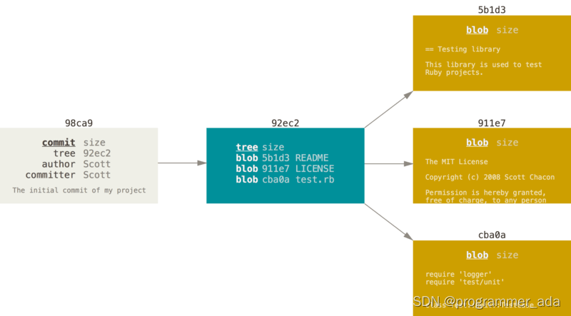
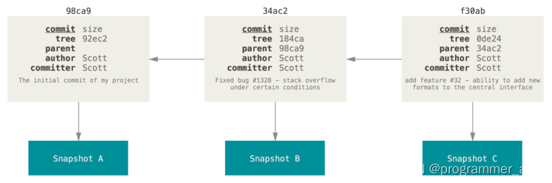
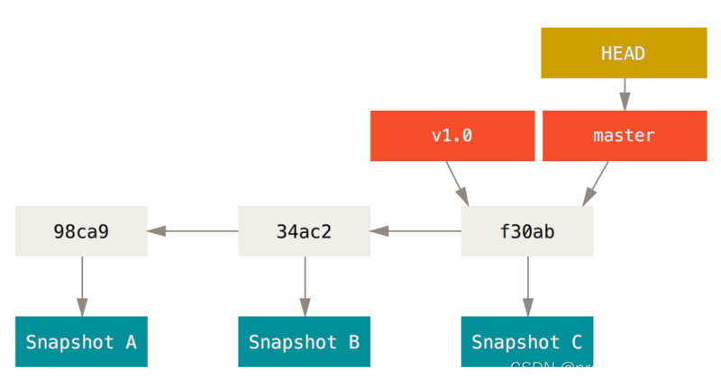
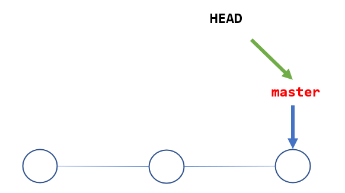
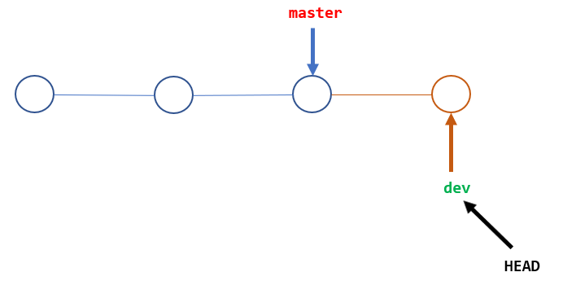
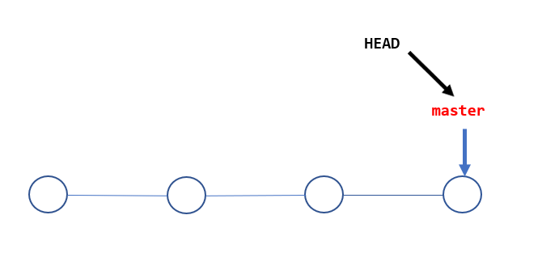
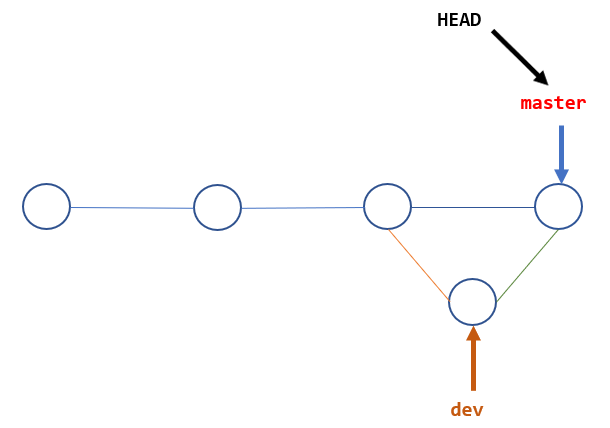

<font face="楷体" size=3>

# GIT 分支管理

## git分支简介

在进行提交操作时，Git 会保存一个提交对象（commit object）。 知道了 Git 保存数据的方式，我们可以很自然的想到——该提交对象会包含一个指向暂存内容快照的指针。 
但不仅仅是这样，该提交对象还包含了作者的姓名和邮箱、提交时输入的信息以及指向它的父对象的指针。 
首次提交产生的提交对象没有父对象，普通提交操作产生的提交对象有一个父对象， 而由多个分支合并产生的提交对象有多个父对象，为了更加形象地说明，我们假设现在有一个工作目录，里面包含了三个将要被暂存和提交的文件。 暂存操作会为每一个文件计算校验和，然后会把当前版本的文件快照保存到 Git 仓库中
（Git 使用 blob 对象来保存它们），最终将校验和加入到暂存区域等待提交：

```
$ git add readme.txt test.md LICENSE
$ git commit -m 'The initial commit of my project'
```

当使用 git commit 进行提交操作时，Git 会先计算每一个子目录（本例中只有项目根目录）的校验和， 然后在 Git 仓库中这些校验和保存为树对象。随后，Git 便会创建一个提交对象， 它除了包含上面提到的那些信息外，还包含指向这个树对象（项目根目录）的指针。 如此一来，Git 就可以在需要的时候重现此次保存的快照。

现在，Git 仓库中有五个对象：三个 blob 对象（保存着文件快照）、一个 树 对象 （记录着目录结构和 blob 对象索引）以及一个 提交 对象（包含着指向前述树对象的指针和所有提交信息）。




首次提交对象及其树结构

做些修改后再次提交，那么这次产生的提交对象会包含一个指向上次提交对象（父对象）的指针。



提交对象及其父对象

Git 的分支，其实本质上仅仅是指向提交对象的可变指针。 Git 的默认分支名字是 master。 在多次提交操作之后，你其实已经有一个指向最后那个提交对象的 master 分支。 master 分支会在每次提交时自动向前移动。



分支及其提交历史

## 创建分支
Git 会把仓库中的每次提交串成一条时间线，这条时间线就是一个分支。在 Git 里，每个仓库都会有一个主分支，即master分支。HEAD严格来说不是指向提交，而是指向master，master才是指向提交的，所以，HEAD指向的就是当前分支。

一开始的时候，master分支是一条线，Git 用master指向最新的提交，再用HEAD指向master，就能确定当前分支，以及当前分支的提交点：



每次提交，master分支都会向前移动一步，这样，随着你不断提交，master分支的线也越来越长。

当我们创建新的分支，例如dev时，Git 新建了一个指针叫dev，指向master相同的提交，再把HEAD指向dev，就表示当前分支在dev上：



你看，Git 创建一个分支很快，因为除了增加一个dev指针，改改HEAD的指向，工作区的文件都没有任何变化！

不过，从现在开始，对工作区的修改和提交就是针对dev分支了，比如新提交一次后，dev指针往前移动一步，而master指针不变：

假如我们在dev上的工作完成了，就可以把dev合并到master上。Git 怎么合并呢？最简单的方法，就是直接把master指向dev的当前提交，就完成了合并：

所以 Git 合并分支也很快！就改改指针，工作区内容也不变！

合并完分支后，甚至可以删除dev分支。删除dev分支就是把dev指针给删掉，删掉后，我们就剩下了一条master分支：


## 步骤

首先，我们创建dev分支，然后切换到dev分支：

```
$ git checkout -b dev
Switched to a new branch 'dev'
```

git checkout命令加上-b参数表示创建并切换，相当于以下两条命令：

```
$ git branch dev
$ git checkout dev
Switched to branch 'dev'
```

然后，用git branch命令查看当前分支：

```
$ git branch
* dev
  master
```

git branch命令会列出所有分支，当前分支前面会标一个*号。
然后，我们就可以在dev分支上正常提交，比如对README.md做个修改，加上一行

```
Creating a new branch is quick.
```

然后提交：

```
$ git add README.md
$ git commit -m "branch test"
[dev 4aac6c7] branch test
 1 file changed, 1 insertion(+)
```

现在，dev分支的工作完成，我们就可以切换回master分支：

```
$ git checkout master
Switched to branch 'master'
```

切换回master分支后，再查看一个README.md文件，刚才添加的内容不见了！因为那个提交是在dev分支上，而master分支此刻的提交点并没有变：



现在，我们把dev分支的工作成果合并到master分支上：

```
$ git merge dev
Updating 599dbdb..4aac6c7
Fast-forward
 readme.txt | 1 +
 1 file changed, 1 insertion(+)
```

git merge命令用于合并指定分支到当前分支。合并后，再查看readme.txt的内容，就可以看到，和dev分支的最新提交是完全一样的。

注意到上面的Fast-forward信息，Git 告诉我们，这次合并是“快进模式”，也就是直接把master指向dev的当前提交，所以合并速度非常快。

当然，也不是每次合并都能Fast-forward，我们后面会讲其他方式的合并。

合并完成后，就可以放心地删除dev分支了：

```
$ git branch -d dev
Deleted branch dev (was 4aac6c7).
```

删除后，查看branch，就只剩下master分支了：

```
$ git branch
* master
```

因为创建、合并和删除分支非常快，所以 Git 鼓励你使用分支完成某个任务，合并后再删掉分支，这和直接在master分支上工作效果是一样的，但过程更安全。


## git switch

我们注意到切换分支使用git checkout <branch>，而 Git 中撤销修改则是git checkout -- <file>，同一个命令，有两种作用，确实有点令人迷惑。

实际上，切换分支这个动作，用switch更科学。因此，最新版本的 Git 提供了新的git switch命令来切换分支：

创建并切换到新的dev分支，可以使用：

```
git switch -c dev
```

直接切换到已有的master分支，可以使用

```
$ git switch master
```

使用新的git switch命令，比git checkout要更容易理解。

## 分支管理策略

通常，合并分支时，如果可能，Git会用Fast forward模式，但这种模式下，删除分支后，会丢掉分支信息。

如果要强制禁用Fast forward模式，Git 就会在merge时生成一个新的commit，这样，从分支历史上就可以看出分支信息。

下面我们实战一下--no-ff方式的git merge：

首先，仍然创建并切换dev分支：

```
$ git switch -c dev
Switched to a new branch 'dev'
```

修改README.md文件，并提交一个新的commit：

```
$ git add README.md 
$ git commit -m "add merge"
[dev f52c633] add merge
 1 file changed, 1 insertion(+)
```

现在，我们切换回master：

```
$ git switch master
Switched to branch 'master'
```

准备合并dev分支，请注意--no-ff参数，表示禁用Fast forward：

```
$ git merge --no-ff -m "merge with no-ff" dev
Merge made by the 'recursive' strategy.
 readme.txt | 1 +
 1 file changed, 1 insertion(+)
```

因为本次合并要创建一个新的commit，所以加上-m参数，把commit描述写进去。

合并后，我们用git log看看分支历史：

```
$ git log --graph --pretty=oneline --abbrev-commit
*   fc76cf7 (HEAD -> master) merge with no-ff
|\  
| * f52c633 (dev) add merge
|/  
*   cf810e4 conflict fixed
```

可以看到，不使用Fast forward模式，merge后就像这样：



## 分支策略

在实际开发中，我们应该按照几个基本原则进行分支管理：

首先，master分支应该是非常稳定的，也就是仅用来发布新版本，平时不能在上面干活；

其次，干活都在dev分支上，也就是说，dev分支是不稳定的，到某个时候，比如1.0版本发布时，再把dev分支合并到master上，并在master分支发布1.0版本；

你和你的小伙伴们每个人都在dev分支上干活，每个人都有自己的分支，时不时地往dev分支上合并就可以了。

所以，团队合作的分支看起来就像这样：


在日常的开发工作中，除了以上介绍的 master 和 dev 两个常用分支外，我们还会有其他类型的分支使用策略：

```
bug 分支

feature 分支
```

### bug分支

在开发过程中，bug 就像家常便饭一样。有了 bug 就需要修复，在 Git 中，由于分支是如此的强大，所以，每个 bug 都可以通过一个新的临时分支来修复，修复后，合并分支，然后将临时分支删除。

当你接到一个修复一个代号101的 bug 的任务时，很自然地，你想创建一个分支 issue-101 来修复它，但是，等等，当前正在dev上进行的工作还没有提交：

```
$ git status
On branch dev
Changes to be committed:
  (use "git reset HEAD <file>..." to unstage)

	new file:   hello.py

Changes not staged for commit:
  (use "git add <file>..." to update what will be committed)
  (use "git checkout -- <file>..." to discard changes in working directory)

	modified:   readme.txt
```

并不是你不想提交，而是工作只进行到一半，还没法提交，预计完成还需1天时间。但是，必须在两个小时内修复该 bug，怎么办？

幸好，Git还提供了一个stash功能，可以把当前工作现场“储藏”起来，等以后恢复现场后继续工作：

```
$ git stash
Saved working directory and index state WIP on dev: f52c633 add merge
```

现在，用git status查看工作区，就是干净的（除非有没有被Git管理的文件），因此可以放心地创建分支来修复 bug。

首先确定要在哪个分支上修复 bug，假定需要在master分支上修复，就从master创建临时分支：

现在，用git status查看工作区，就是干净的（除非有没有被Git管理的文件），因此可以放心地创建分支来修复 bug。

首先确定要在哪个分支上修复 bug，假定需要在master分支上修复，就从master创建临时分支：

现在修复bug，需要把“Git is free software …”内容改为“Git is a free software …”，然后提交：

```
$ git add readme.txt 
$ git commit -m "fix bug 101"
[issue-101 8842ff5] fix bug 101
 1 file changed, 1 insertion(+), 1 deletion(-)
```

修复完成后，切换到master分支，并完成合并，最后删除issue-101分支：

```
$ git switch master
Switched to branch 'master'
Your branch is ahead of 'origin/master' by 6 commits.
  (use "git push" to publish your local commits)

$ git merge --no-ff -m "merged bug fix 101" issue-101
Merge made by the 'recursive' strategy.
 readme.txt | 2 +-
 1 file changed, 1 insertion(+), 1 deletion(-)
```

太棒了，原计划两个小时的 bug 修复只花了5分钟！现在，是时候接着回到dev分支干活了！

```
$ git switch dev
Switched to branch 'dev'

$ git status
On branch dev
nothing to commit, working tree clean
```

工作区是干净的，刚才的工作现场存到哪去了？用git stash list命令看看：

```
$ git stash list
stash@{0}: WIP on dev: f52c633 add merge
```

工作现场还在，Git 把stash内容存在某个地方了，但是需要恢复一下，有两个办法：

一是用git stash apply恢复，但是恢复后，stash内容并不删除，你需要用git stash drop来删除；

另一种方式是用git stash pop，恢复的同时把stash内容也删了：

```
$ git stash pop
On branch dev
Changes to be committed:
  (use "git reset HEAD <file>..." to unstage)

	new file:   hello.py

Changes not staged for commit:
  (use "git add <file>..." to update what will be committed)
  (use "git checkout -- <file>..." to discard changes in working directory)

	modified:   readme.txt

Dropped refs/stash@{0} (5d677e2ee266f39ea296182fb2354265b91b3b2a)
```

再用git stash list查看，就看不到任何stash内容了：

你可以多次stash，恢复的时候，先用git stash list查看，然后恢复指定的stash，用命令：

```
$ git stash apply stash@{0}
```

在master分支上修复了bug后，我们要想一想，dev分支是早期从master分支分出来的，所以，这个bug其实在当前dev分支上也存在。

那怎么在dev分支上修复同样的bug？重复操作一次，提交不就行了？在 Git 中还有比这更简单的方法可以实现。

同样的 bug，要在dev上修复，我们只需要把8842ff5 fix bug 101这个提交所做的修改“复制”到dev分支。注意：我们只想复制8842ff5 fix bug 101这个提交所做的修改，并不是把整个master分支merge过来。

为了方便操作，Git 专门提供了一个cherry-pick命令，让我们能复制一个特定的提交到当前分支：

```
$ git branch
* dev
  master
$ git cherry-pick 8842ff5
[dev 0944c8c] fix bug 101
 1 file changed, 1 insertion(+), 1 deletion(-)
```

Git 自动给dev分支做了一次提交，注意这次提交的commit是0944c8c，它并不同于master的8842ff5，因为这两个commit只是改动相同，但确实是两个不同的commit。用git cherry-pick，我们就不需要在dev分支上手动再把修 bug 的过程重复一遍。

既然可以在master分支上修复bug后，在dev分支上可以“重放”这个修复过程，那么直接在dev分支上修复 bug，然后在master分支上“重放”行不行？当然可以，不过你仍然需要git stash命令保存现场，才能从dev分支切换到master分支。


### feature分支

在开发过程中，除了 bug 外，也还会有无穷无尽的新的功能要不断添加进来。

添加一个新功能时，你肯定不希望因为一些实验性质的代码，把主分支搞乱了，所以，每添加一个新功能，最好新建一个feature分支，在上面开发，完成后，合并，最后，删除该feature分支。

现在，你终于接到了一个新任务：开发代号为Vulcan的新功能，该功能计划用于下一代星际飞船。

于是准备开发：

```
$ git switch -c feature-vulcan
Switched to a new branch 'feature-vulcan'
```

5分钟后，开发完毕：

```
$ git add vulcan.md

$ git status
On branch feature-vulcan
Changes to be committed:
  (use "git reset HEAD <file>..." to unstage)

	new file:   vulcan.md

$ git commit -m "add feature vulcan"
[feature-vulcan d12cf23] add feature vulcan
 1 file changed, 3 insertions(+)
 create mode 100644 vulcan.md
```

切回dev，准备合并：

```
$ git switch dev
```

一切顺利的话，feature分支和bug分支是类似的，合并，然后删除。

但是！就在此时，接到上级命令，因经费不足，新功能必须取消！虽然白干了，但是这个包含机密资料的分支还是必须就地销毁：

```
git branch -d feature-vulcan
error: The branch 'feature-vulcan' is not fully merged.
If you are sure you want to delete it, run 'git branch -D feature-vulcan'.
```

销毁失败。Git 友情提醒，feature-vulcan分支还没有被合并，如果删除，将丢失掉修改，如果要强行删除，需要使用大写的-D参数。。

现在我们强行删除：

```
$ git branch -D feature-vulcan
Deleted branch feature-vulcan (was d12cf23).
```

终于删除成功！