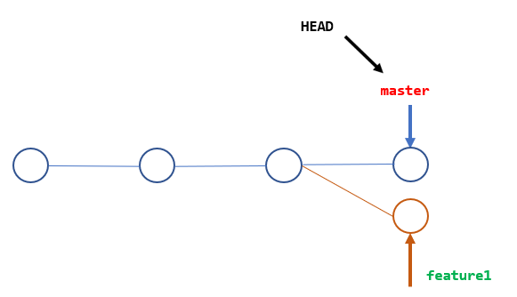

<font face="楷体" size=3>

# Git 解决冲突

## 解决冲突

合并分支往往也不是一帆风顺的。

准备新的feature1分支，继续我们的新分支开发：

```
$ git switch -c feature1
Switched to a new branch 'feature1'
```

修改readme.txt最后一行，改为：

```
Creating a new branch is quick AND simple.
```

在feature1分支上提交：

```
$ git add readme.txt
$ git commit -m "AND simple"
[feature1 2443c95] AND simple
 1 file changed, 1 insertion(+), 1 deletion(-)
```

切换到master分支：

```
$ git switch master
Switched to branch 'master'
```

在master分支上把readme.txt文件的最后一行改为：

```
Creating a new branch is quick & simple.
```

提交：

```
$ git add readme.txt 
$ git commit -m "& simple"
[master 06e5e3a] & simple
 1 file changed, 1 insertion(+), 1 deletion(-)
```

现在，master分支和feature1分支各自都分别有新的提交，变成了这样：



这种情况下，Git 无法执行“快速合并”，只能试图把各自的修改合并起来，但这种合并就可能会有冲突，我们试试看：

```
$ git merge feature1
Auto-merging readme.txt
CONFLICT (content): Merge conflict in readme.txt
Automatic merge failed; fix conflicts and then commit the result.
```

果然冲突了！Git 告诉我们，readme.txt文件存在冲突，必须手动解决冲突后再提交。git status也可以告诉我们冲突的文件：

```
$ git status
On branch master
You have unmerged paths.
  (fix conflicts and run "git commit")
  (use "git merge --abort" to abort the merge)

Unmerged paths:
  (use "git add <file>..." to mark resolution)
	both modified:   readme.txt

no changes added to commit (use "git add" and/or "git commit -a")
```

我们可以直接查看readme.txt的内容：

```
Git is a distributed version control system.
Git is free software distributed under the GPL.
Git has a mutable index called stage.
Git tracks changes of files.
<<<<<<< HEAD
Creating a new branch is quick & simple.
=======
Creating a new branch is quick AND simple.
>>>>>>> feature1
```

Git 用<<<<<<<，=======，>>>>>>>标记出不同分支的内容，我们修改如下后保存：

```
Creating a new branch is quick and simple.
```

再提交：

```
$ git add readme.txt 
$ git commit -m "conflict fixed"
[master fb8b190] conflict fixed
```

现在，master分支和feature1分支变成了下图所示：


用带参数的git log也可以看到分支的合并情况：

```
$ git log --graph --pretty=oneline --abbrev-commit
*   fb8b190 (HEAD -> master) conflict fixed
|\
| * 2443c95 (feature1) add simple
* | 06e5e3a & simple
|/
* 4aac6c7 branch test
* 599dbdb understand how stage works
* 1985ccf append GPL
* 27f9df6 add distributed
* e372504 wrote a readme file
```

最后，删除feature1分支：

```
$ git branch -d feature1
Deleted branch feature1 (was 2443c95).
```

工作完成。

## git cherry-pick

对于多分支的代码库，将代码从一个分支转移到另一个分支是常见需求。

这时分两种情况。一种情况是，你需要另一个分支的所有代码变动，那么就采用合并git merge。另一种情况是，你只需要部分代码变动（某几个提交），这时可以采用 Cherry pick。

### git cherry-pick命令的作用，就是将指定的提交commit应用于其他分支。

```
$ git cherry-pick <commitHash>
```

上面命令就会将指定的提交commitHash，应用于当前分支。这会在当前分支产生一个新的提交，当然它们的哈希值会不一样。

举例来说，代码仓库有master和feature两个分支。

```
    a - b - c - d   Master
         \
           e - f - g Feature
```

现在将提交f应用到master分支。

```
# 切换到 master 分支
$ git checkout master

# Cherry pick 操作
$ git cherry-pick f
```

上面的操作完成以后，代码库就变成了下面的样子。

```
  a - b - c - d - f   Master
         \
           e - f - g Feature
```

从上面可以看到，master分支的末尾增加了一个提交f。

git cherry-pick命令的参数，不一定是提交的哈希值，分支名也是可以的，表示转移该分支的最新提交。

```
$ git cherry-pick feature
```

上面代码表示将feature分支的最近一次提交，转移到当前分支。

### git cherry-pick 转移多个提交

Cherry pick 支持一次转移多个提交。

```
$ git cherry-pick <HashA> <HashB>
```

上面的命令将 A 和 B 两个提交应用到当前分支。这会在当前分支生成两个对应的新提交。

如果想要转移一系列的连续提交，可以使用下面的简便语法。

```
$ git cherry-pick A..B 
```

上面的命令可以转移从 A 到 B 的所有提交。它们必须按照正确的顺序放置：提交 A 必须早于提交 B，否则命令将失败，但不会报错。

注意，使用上面的命令，提交 A 将不会包含在 Cherry pick 中。如果要包含提交 A，可以使用下面的语法。

```
$ git cherry-pick A^..B 
```

### git cherry-pick 配置项

git cherry-pick命令的常用配置项如下。

```
-e，--edit: 打开外部编辑器，编辑提交信息。
-n，--no-commit: 只更新工作区和暂存区，不产生新的提交。
-x: 在提交信息的末尾追加一行cherry picked from commit ...，方便以后查到这个提交是如何产生的。
-s，--signoff: 在提交信息的末尾追加一行操作者的签名，表示是谁进行了这个操作。
-m parent-number，--mainline parent-number: 如果原始提交是一个合并节点，来自于两个分支的合并，那么 Cherry pick 默认将失败，因为它不知道应该采用哪个分支的代码变动。
-m配置项告诉 Git，应该采用哪个分支的变动。它的参数parent-number是一个从1开始的整数，代表原始提交的父分支编号。git cherry-pick -m 1 <commitHash>表示，Cherry pick 采用提交commitHash来自编号1的父分支的变动。一般来说，1号父分支是接受变动的分支，2号父分支是作为变动来源的分支。
```

### git cherry-pick 代码冲突

如果操作过程中发生代码冲突，Cherry pick 会停下来，让用户决定如何继续操作。

（1）–continue

用户解决代码冲突后，第一步将修改的文件重新加入暂存区（git add .），第二步使用下面的命令，让 Cherry pick 过程继续执行。

```
$ git cherry-pick --continue
```

（2）–abort

```
发生代码冲突后，放弃合并，回到操作前的样子。
```

（3）–quit

发生代码冲突后，退出 Cherry pick，但是不回到操作前的样子。

git cherry-pick 转移到另一个代码库
Cherry pick 也支持转移另一个代码库的提交，方法是先将该库加为远程仓库。

```
$ git remote add target git://gitUrl
```

上面命令添加了一个远程仓库target。

然后，将远程代码抓取到本地。

```
$ git fetch target
```

上面命令将远程代码仓库抓取到本地。

接着，检查一下要从远程仓库转移的提交，获取它的哈希值。

```
$ git log target/master
```

最后，使用git cherry-pick命令转移提交。

```
$ git cherry-pick <commitHash>
```

